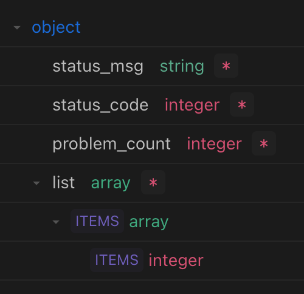

# 关于竞赛结果展示

选择一场竞赛，展示参与竞赛的学生学号和做题状态。

## 页面设计
以表格形式展示，第一列是学生学号(通过学生学号排序)，后`n`列是竞赛中的题目。(竞赛题目数通过`contest_exercise_associations`查询)
学生对应题目的做题状态通过`contest_exercise_statuses`查询

{:height="50%" width="50%"}

返回一个二维字符串数组, 长度为在此竞赛有提交记录的学生个数。第二维的长度为此竞赛中题目数 + 1。
每一行的第一个值为学生学号，其后的值为对应题目的提交状态。`'0'`为未提交, `'1'`为通过, `'2'`为错误。