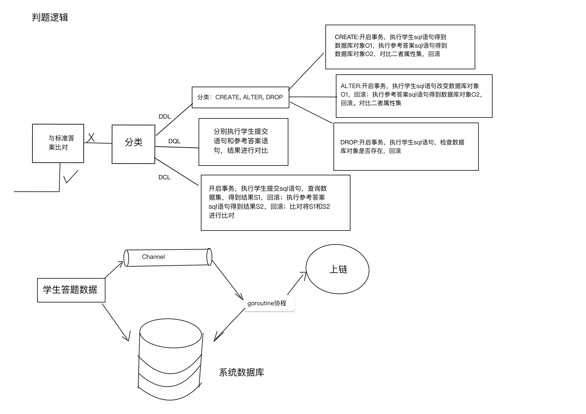

# 判题handel

判题流程: 

用户做题做题请求经过Routers层转发到对应到判题handle处理该用户请求。经过如下图所示判题流程

经过上图步骤，handle拿到该用户的做题数据，如停留在做题页面的时间，做题结果，提交的答案，浏览器信息。该handle创建一个协程A，协程A负责将做题数据写入与上链协程B相连的channel(若不使用协程A对channel进行写操作，当channel缓冲区已被写满时，handle将被阻塞，则不能及时返回信息，影响效率)。协程B由主程序启动时初始化，循环从channel中读需要上链的信息(信息为定义的结构体)，完成上链操作后，创建协程C将上链信息写入系统数据库中，协程B则继续从channel中读取信息并上链。