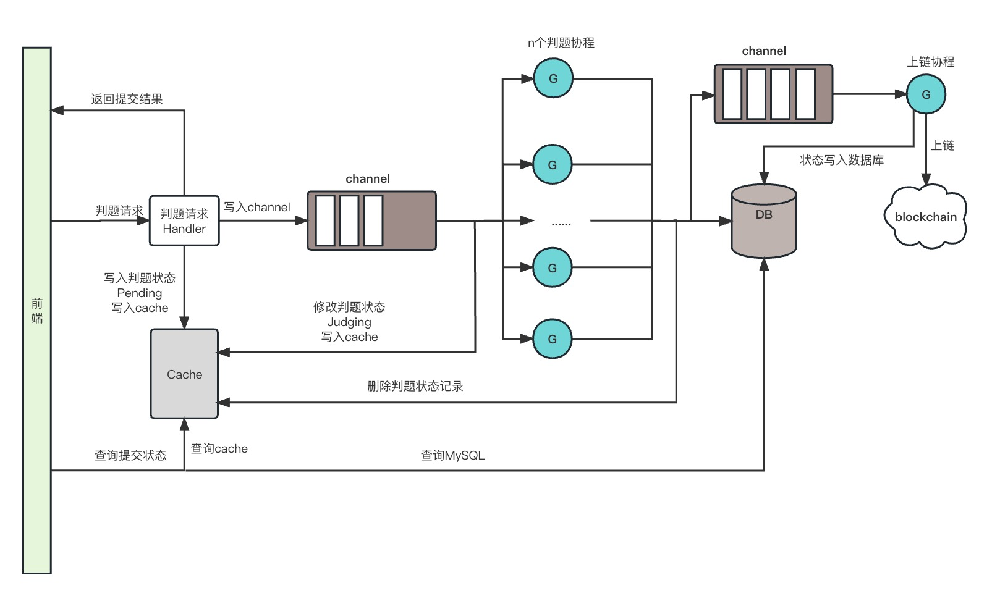

# 用户提交做题答案逻辑

后端收到提交答案请求后，将请求体中`userID`, `userType`, `exerciseID`, `answer`, `subimitTime`以及请求头中`UserAgent`保存在`SubmitMessage`结构体中并发送到`JudgeQueue`中。
启动`SetJudgeStatusInQueue()`将包含`userID`, `userType`, `exerciseID`, `status`, `submitTimt.Unix()`当前判题信息写入缓存，并且将`status`设置为`1`。

> `status: 1->pending; 2->judging`

启动服务的时候开启n个判题goroutine从`JudgeQueue`中读取`SubmitMessage`, 将缓存中对应的判题信息中的`status`设置为`2`(judging)，开始判题流程。
判题结束后，将判题信息从缓存中删去，写入DB。
 
用户查询提交状态时，先查询Cache(pending or judging)，后查询MySQL(AC, WA, RE)
